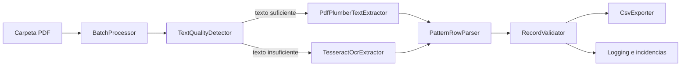

# OCR Factura Reader

Extractor de equipos de facturas de renta de impresoras (CFDI CopyJet o diseños equivalentes). Requiere Python 3.12.

## Arquitectura



`pdfplumber` es la ruta primaria porque conserva texto, coordenadas y funciona bien con tablas fragmentadas. Camelot (lattice/stream) o Tabula son alternativas útiles cuando un proveedor entrega tablas con bordes consistentes; pueden añadirse como extractores intercambiables. Tesseract se usa sólo cuando la detección de texto digital no alcanza el umbral configurado.

## Estructura

- `src/ocr_factura_reader/models.py`: contratos de datos inmutables.
- `config/patterns.json`: regex y reglas adaptables sin tocar el código.
- `src/ocr_factura_reader/extraction.py`: detección digital, pdfplumber y OCR.
- `src/ocr_factura_reader/parser.py`: reconstrucción de filas mediante patrón estructural.
- `src/ocr_factura_reader/validation.py`: reglas de integridad.
- `src/ocr_factura_reader/export.py`: CSV UTF-8.
- `src/ocr_factura_reader/pipeline.py`: procesamiento individual y masivo.
- `src/ocr_factura_reader/cli.py`: interfaz de línea de comandos.

## Instalación y uso

```powershell
py -3.12 -m venv .venv
.\.venv\Scripts\Activate.ps1
pip install -e ".[test]"
ocr-factura .\facturas --output-dir .\out --config config/patterns.json
```

Para OCR:

```powershell
pip install -e ".[ocr]"
# También debe estar instalado Tesseract y Poppler, disponibles en PATH.
ocr-factura facturas --output-dir out --ocr --log-level INFO
```

Coloca las facturas en `facturas/`. El programa procesa todos los PDF de forma recursiva y genera un CSV independiente por factura en `out/`. El nombre usa el mes de emisión en español y el folio, por ejemplo `out/datos_equipos_agosto-2026_CDA-14398.csv`. Si faltan fecha o folio, usa un nombre seguro basado en el archivo y genera un `_issues.csv` junto al resultado. Los registros válidos de otras facturas no se detienen por una incidencia.

Para procesar un PDF individual y elegir el nombre manualmente:

```powershell
ocr-factura factura.pdf -o equipos.csv --config config/patterns.json
```

```powershell
py -3.12 -m ocr_factura_reader.cli .\facturas  
```

## Validación

Se rechazan filas sin modelo, serie, ubicación, tipo de servicio permitido o números válidos; se comprueba que `lectura_actual >= lectura_anterior` y que el delta coincide con `paginas_procesadas` dentro del margen configurado. El margen admite diferencias reales de contadores, pero evita capturar totales fiscales como filas.

## Salida

```csv
modelo,numero_serie,ubicacion_departamento,lectura_anterior,lectura_actual,paginas_procesadas,tipo_servicio
MX-C300W,5300340700,policia analisis,47816,48307,491,PP BYN
MX-C300W,5300340700,policia analisis,56647,57000,353,PP COLOR
```
